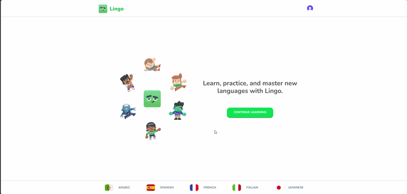

# Lingo App

A modern, gamified language-learning platform designed to help users learn, practice, and master new languages through interactive lessons, achievements, and friendly competition.

🔗 **Live Demo:** [https://portfolio-lingo-app.vercel.app](https://portfolio-lingo-app.vercel.app)  
🌐 **Portfolio:** [https://aymenghris.vercel.app](https://aymenghris.vercel.app)  

## 📸 Preview

## ✨ Key Features
- **Multiple Language Courses:** Choose from various language courses including Spanish, French, Italian, Japanese, and Arabic.
- **Gamified Learning Path:** Interactive lessons with diverse challenge types (multiple-choice, audio-assisted, translation) and real-time sound effects.
- **Hearts & XP Mechanics:** Track progress with XP and manage a dynamic heart system. Hearts decrease on incorrect answers and recharge over time or via the shop.
- **Leaderboards:** Stay motivated by competing with other learners on a weekly leaderboard ranked by XP.
- **Daily Quests:** Complete custom milestone targets (e.g., earning a specific amount of XP) to track daily progress.
- **In-App Shop:** Exchange points to refill hearts or upgrade to a premium subscription.
- **Stripe Pro Subscriptions:** Secure billing integration with Stripe for subscription management and unlimited hearts.
- **Clerk Authentication:** Seamless user authentication and profile management supporting social logins.
- **Admin Dashboard:** A comprehensive administrative panel built with React Admin to manage courses, units, lessons, challenges, and options.

## 🛠 Tech Stack
- **Frontend:** `Next.js` `React` `Tailwind CSS` `Zustand` `React Admin`
- **Backend/Services:** `Drizzle ORM` `Neon Serverless PostgreSQL` `Clerk Auth` `Stripe` `Zod`
- **Deployment:** `Vercel`

## 💡 What I Learned
- **Database Modeling & ORMs:** Gained experience with Object-Relational Mapping (ORM) using `Drizzle ORM` to structure and query database schemas, as well as managing and organizing complex relational data models.
- **Data Validation:** Utilized `Zod` for robust runtime schema validation and ensuring type safety across client-server boundaries.
- **State Management:** Designed and structured global state using `Zustand`, leveraging `devtools` for testing and debugging state transitions.
- **Modern Next.js Architecture:** Implemented Next.js Server Actions to securely execute database mutations directly from components.
- **Authentication & Middleware:** Integrated Clerk for user authentication, session management, and route protection.
- **Type-Safe Seeding:** Leveraged advanced TypeScript types to structure bulletproof mock and seed data, minimizing seeding errors.
- **Scalable Architecture & Component Design:** Organized the directory structure to promote modularity, readability, and component reusability, making the codebase maintainable and easier to debug.
- **Webhooks & Third-Party Integration:** Configured webhooks to synchronize user profiles on sign-up (Clerk) and manage Stripe subscription cycles asynchronously.

## 👤 Contact
[LinkedIn](https://linkedin.com/in/aymenghris) • [Email](mailto:aymenghris@outlook.com) • [GitHub](https://github.com/aymenghris)
